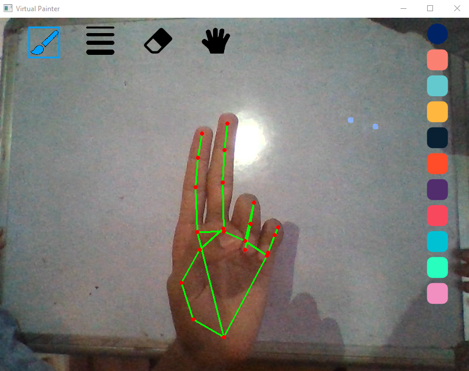
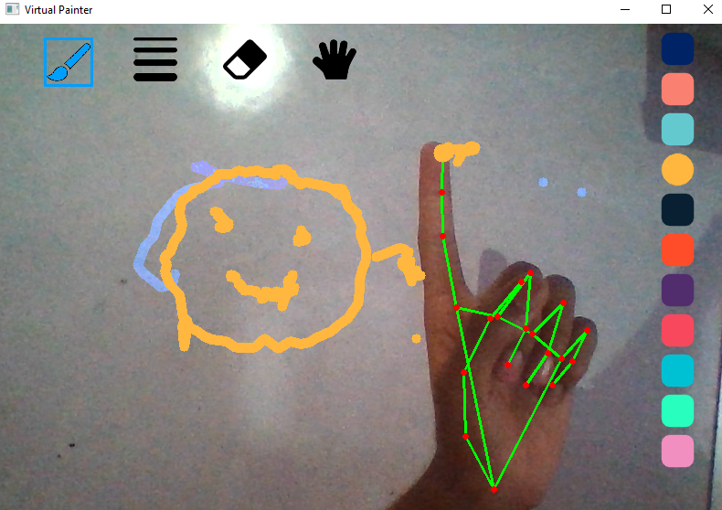
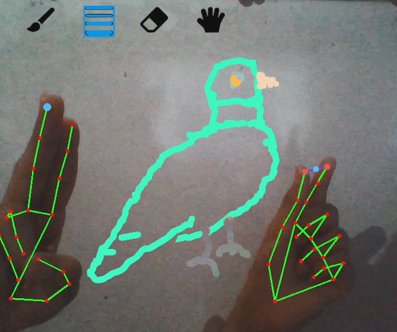

# Virtual Painter

VirtualPainter using openCV and mediapipe
| Virtual Painter     | Smile Art               | Parrot Art               |
|---------------------|-------------------------|--------------------------|
|||

## Run
1. Install dependencies
   ```bash
   pip install -r requirements.txt 
   ```
2. Run Program
   ```bash
   python PainterModule.py 
   ```
   
